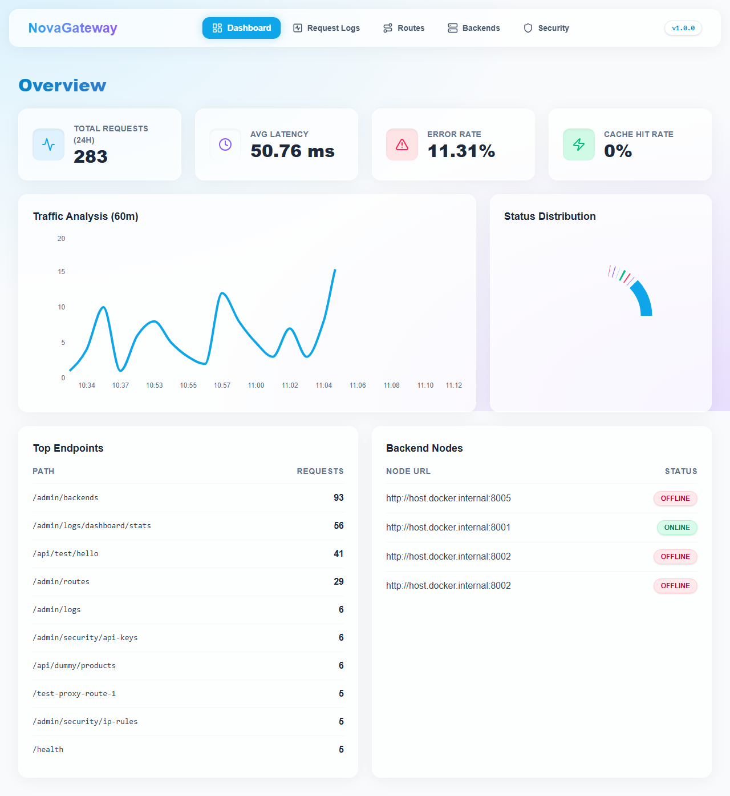
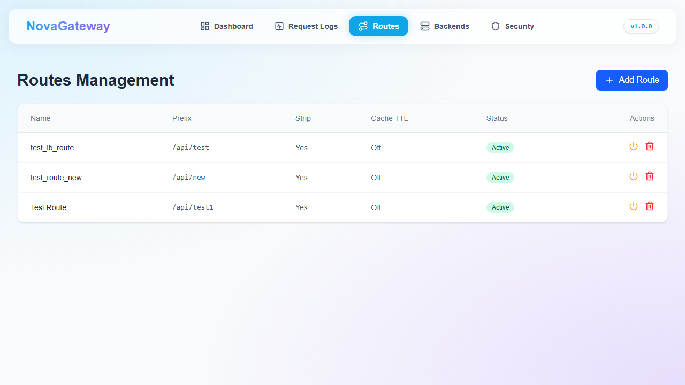
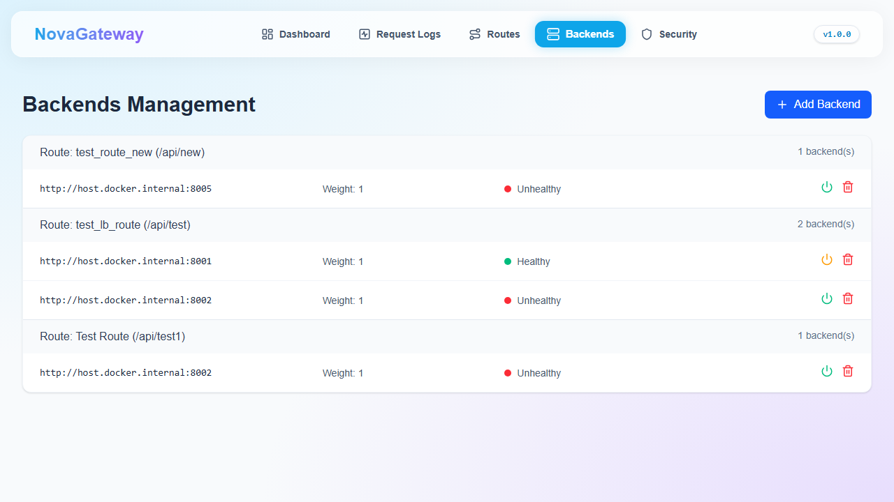
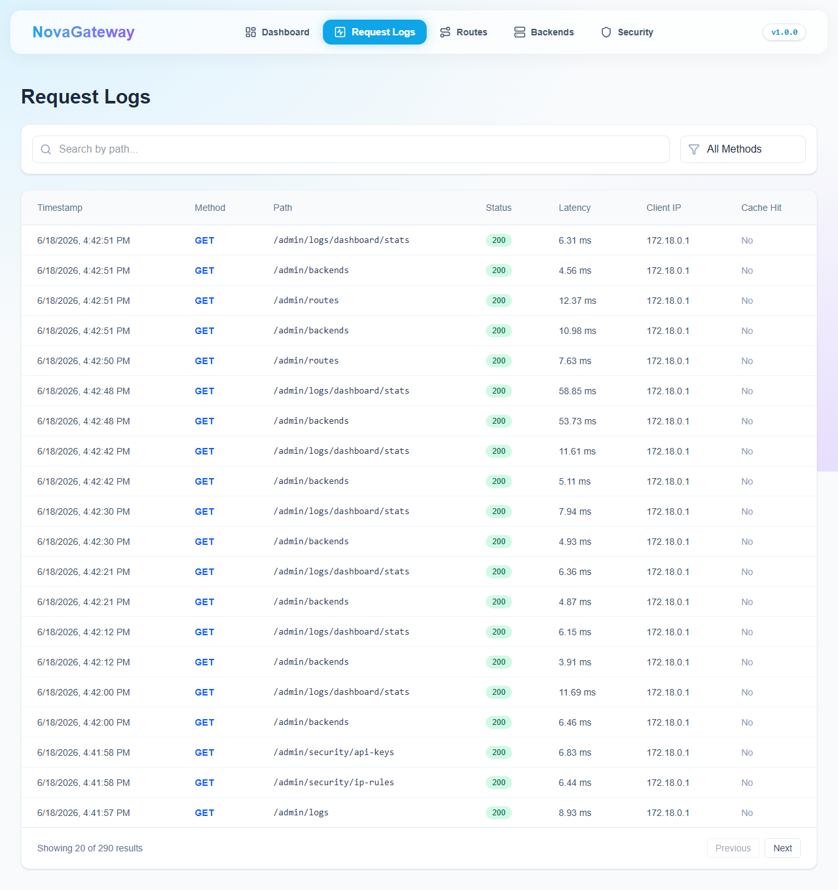
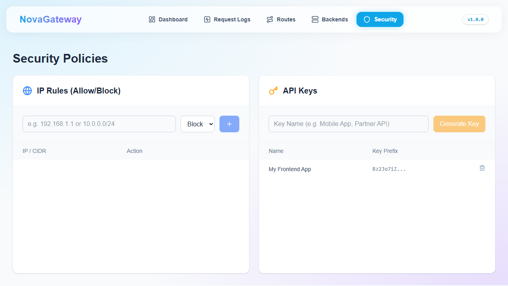

<div align="center">

# 🚀 NovaGateway
### *An Enterprise-Grade, High-Performance Reverse Proxy & API Gateway*

<br />


**NovaGateway** is a dynamic, asynchronous API Gateway and Reverse Proxy built to handle modern microservice architectures. Designed from the ground up for speed, observability, and dynamic configuration, NovaGateway manages routing, load balancing, caching, security, and detailed request telemetry seamlessly.

---

</div>

## ✨ Key Features

- 🚦 **Dynamic Routing Engine**: Database-driven routing allowing you to configure and update endpoints on the fly without restarting the gateway.
- ⚖️ **Intelligent Load Balancing**: Supports multiple strategies including `Round-Robin` and `Weighted Round-Robin`, distributing traffic evenly across backend nodes.
- 🩺 **Active Health Checks**: A background monitoring loop actively checks backend health and performs automatic failovers to prevent downtime.
- 🛡️ **Robust Security**: Redis-backed Sliding-Window Rate Limiting, IP filtering, request size limits, and configurable API Key authentication.
- ⚡ **High-Performance Caching**: Instantaneous response times for static or slow `GET` endpoints via Redis caching.
- 📊 **Real-time Observability**: Structured JSON logging intercepts and records request latencies, methods, and paths.
- 🖥️ **Futuristic Admin Dashboard**: A beautifully designed React frontend featuring a glassmorphic UI to visualize metrics and manage configurations effortlessly.

---

## 📸 Application Showcase

<table>
  <tr>
    <td width="50%" valign="top">
      <h3>1. 📊 Telemetry Overview</h3>
      <p>The dashboard provides a real-time matrix of all traffic passing through the gateway. You can monitor the total requests over 24 hours, track average latencies, visualize traffic spikes via the line charts, and check the active status of all backend nodes.</p>
      
    </td>
    <td width="50%" valign="top">
      <h3>2. 🛣️ Dynamic Routes Management</h3>
      <p>Easily create, update, and manage your API routes. The gateway intelligently forwards traffic matched by path prefixes to registered downstream backends.</p>
      
    </td>
  </tr>
  <tr>
    <td width="50%" valign="top">
      <h3>3. 🖥️ Load Balancing & Backends</h3>
      <p>Add multiple backend instances (URLs) to a single route and assign them specific traffic weights. The gateway actively monitors these nodes and routes requests accordingly.</p>
      
    </td>
    <td width="50%" valign="top">
      <h3>4. 📝 Granular Request Logging</h3>
      <p>Every request that flows through the proxy is intercepted, measured, and securely logged to the PostgreSQL database for deep auditing and troubleshooting.</p>
      
    </td>
  </tr>
  <tr>
    <td colspan="2" align="center" valign="top">
      <h3>5. 🛡️ Global Security Configurations</h3>
      <p>Define global gateway policies. Update allowed IP addresses, configure maximum request sizes, and dictate the strictness of your rate limiting algorithms.</p>
      
    </td>
  </tr>
</table>

---

## 🚀 Getting Started

### Prerequisites
- Docker and Docker Compose
- Node.js (for local frontend development)
- Python 3.10+ (for local backend development)

### Quick Start (Production Setup)
1. **Clone the repository**
   ```bash
   git clone https://github.com/Nigam-Vaghani/NovaGateway.git
   cd NovaGateway
   ```

2. **Start the Stack**
   NovaGateway is fully containerized. A single command brings up the Gateway, Database, Cache, and UI.
   ```bash
   make dev
   ```
   *or manually using docker-compose:*
   ```bash
   docker-compose up -d --build
   ```

3. **Run Database Migrations**
   ```bash
   make migrate
   ```

4. **Access the Gateway**
   - Proxy Traffic Port: `http://localhost:8000`
   - Admin UI Dashboard: `http://localhost:3000`

---

## 🏗️ Architecture Stack

- **Backend / Proxy Engine:** Python, FastAPI, HTTPX, SQLAlchemy, Uvicorn
- **Database:** PostgreSQL (managed asynchronously via `asyncpg`)
- **Cache & Rate Limiting:** Redis
- **Frontend / Admin UI:** React (Vite), TypeScript, TailwindCSS v4, Recharts, React Query
- **Deployment:** Docker, Docker Compose, Makefile automation

---

## 👤 Author

**Nigam Vaghani**
- GitHub: [@Nigam-Vaghani](https://github.com/Nigam-Vaghani)